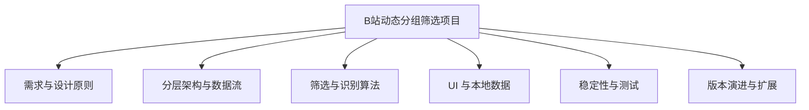
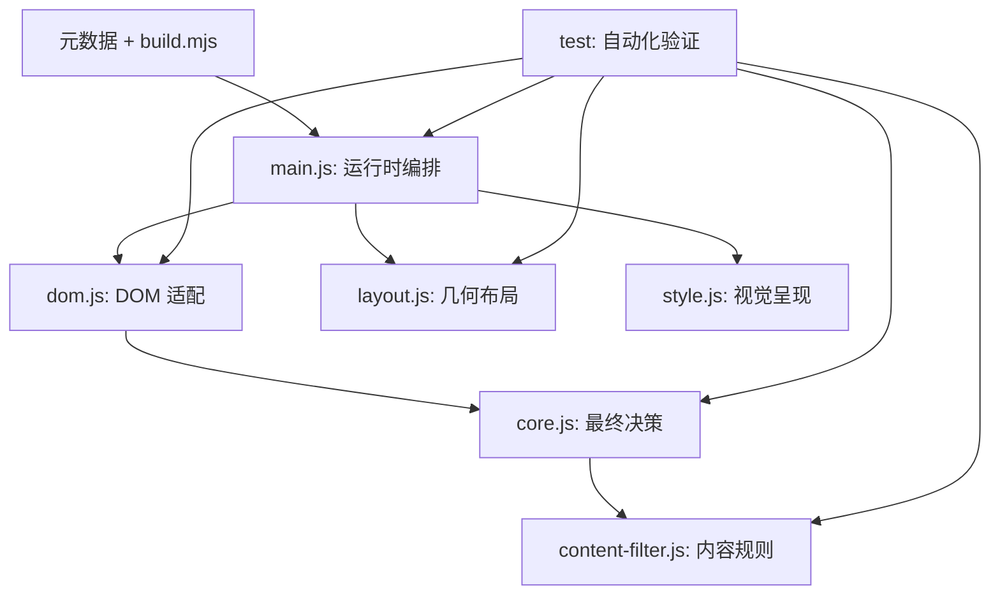
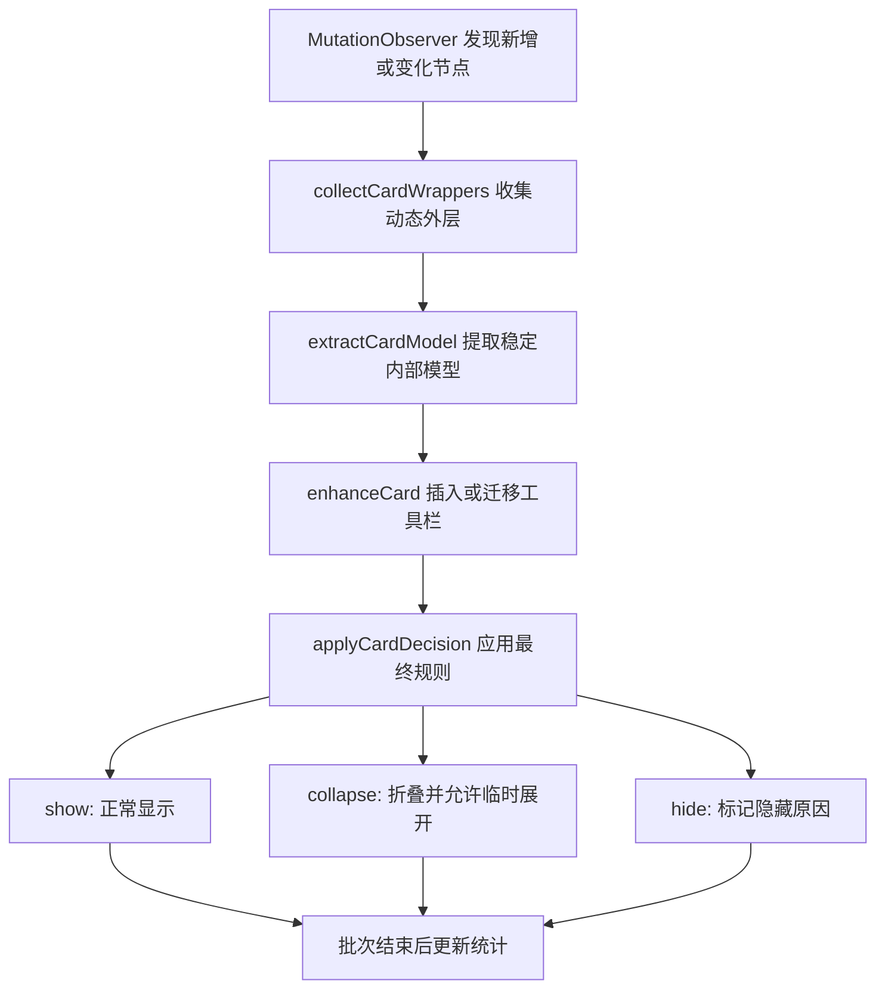
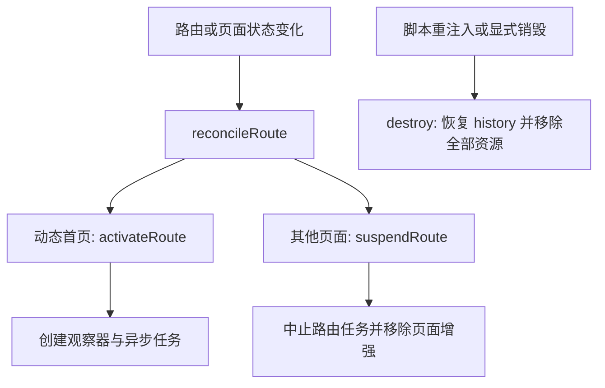
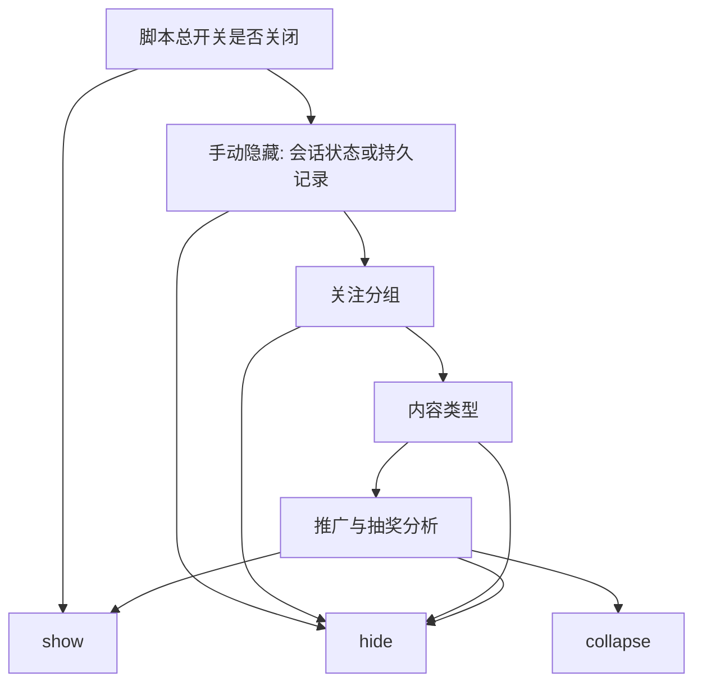
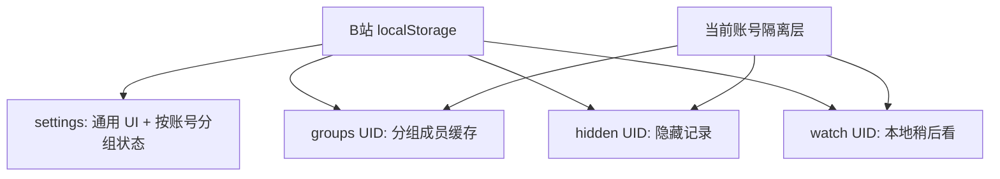
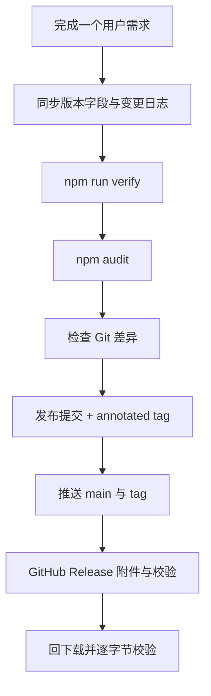

# B站动态分组筛选: 开发设计与演进指南

> 文档版本: 1.0
> 对应脚本版本: v3.0.2
> 编写日期: 2026-09-07
> 适合读者: 想学习用户脚本、前端状态管理、规则系统、DOM 适配与自动化测试的开发者

这不是一份单纯的功能说明书，而是一份以真实项目为案例的工程学习材料。它尝试回答四个问题:

1. 一个看似简单的“筛选 B 站动态”需求，为什么最终会演化出多个独立模块？
2. 面对非公开 DOM、内部接口、无限滚动和虚拟列表，怎样让脚本尽量稳定？
3. 推广和抽奖为什么不能靠单个关键词直接屏蔽？
4. 如何让每次功能变化都有测试、构建产物、Git 标签和可回滚的 Release？

项目是独立重写实现。参考脚本只提供问题背景，当前的筛选核心、DOM 提取、请求封装、本地存储、界面、样式、构建和测试均在本项目中重新设计。

---

## 阅读导图



建议先顺序阅读第 1 至第 4 章，建立整体模型；然后根据兴趣选择算法、UI 或稳定性章节。最后用“扩展新规则”一章把知识串起来。

## 1. 从用户需求到工程目标

### 1.1 最初的问题

B 站动态页把所有已关注账号的内容汇合在同一条信息流里。原始需求是“按关注分组查看动态”，但真实使用很快暴露出更多问题:

- 用户可能同时关注技术、游戏、资讯等不同分组，希望只看其中一部分。
- 某个账号可能同时属于多个分组，包含和排除会发生冲突。
- 视频、图文、直播、番剧等内容类型需要独立控制。
- UP 主可能发布商品推广、搜索口令、优惠券或互动抽奖。
- 用户希望临时隐藏单条动态，又不想修改 B 站官方数据。
- 浮动 UI 不能遮挡正文，还要兼顾四角位置、大字号和窄屏。
- B 站是单页应用，动态卡片会延迟加载、重绘并复用 DOM 节点。

因此，项目真正要解决的不是一个 `display: none`，而是“在不掌控目标网站代码的前提下，构建一个可解释、可恢复、低误伤的本地筛选层”。

### 1.2 六条核心设计原则

| 原则 | 工程含义 | 典型体现 |
|---|---|---|
| 默认放行 | 证据不足时不隐藏 | 作者未知时分组规则放行、类型未知时类型规则放行、分组未加载时分组规则放行；单卡处理异常才整卡放行 |
| 多信号组合 | 单个通用词不作最终决定 | 价格、平台名或“抽奖”单独出现不会触发屏蔽 |
| 纯规则可解释 | 结果应能追溯到明确原因 | 推广和抽奖分析返回类别、置信度、分值和原因列表 |
| 本地优先 | 不上传账号内容和阅读行为 | 设置、隐藏记录和稍后看只保存在当前域的 `localStorage` |
| 生命周期可取消 | 旧页面和旧账号的异步任务不能污染新状态 | `AbortController`、路由代次和重筛令牌共同防竞态 |
| 可回滚发布 | 交付物必须能定位和恢复 | 语义化版本、发布提交、annotated tag、Release 与 SHA-256 |

这里最重要的是“默认放行”。网页 DOM 和内部接口不是稳定契约，如果把未知情况当作“不匹配”，一次站点改版就可能把整条信息流清空。保留可疑内容比误删内容更适合阅读辅助工具。

### 1.3 明确的非目标

项目刻意不做以下事情:

- 不修改关注关系或关注分组成员。
- 不写入 B 站官方稍后看。
- 只读取 `DedeUserID` 的数字 UID 快照用于账号隔离；不读取 `SESSDATA` 等认证凭据，也不复制、导出或上传 Cookie。
- 不使用远程 AI、图片 OCR 或外部运行时依赖来判断内容。
- 不承诺跨设备同步，也不承诺识别图片中没有文字线索的广告。

非目标不是“缺功能”，而是控制风险和复杂度的边界。比如 OCR 能提升图片广告召回率，却会引入模型体积、性能、隐私、误判和更新供应链问题，已经超出轻量用户脚本的合理范围。

## 2. 项目结构与分层架构

### 2.1 文件职责

| 文件 | 核心职责 | 推荐阅读入口 |
|---|---|---|
| `src/userscript.meta.txt` | 用户脚本元数据、安装范围和更新地址 | 先理解脚本在哪些页面运行 |
| `src/dom.js` | 从不稳定网页 DOM 提取保守、可信的卡片模型 | `extractCardModel()` |
| `src/content-filter.js` | 把结构信号和文本信号分析为推广/抽奖置信度 | `analyzeContentSignals()` |
| `src/core.js` | 设置归一化、分组三态、最终卡片决策、本地数据算法 | `evaluateCard()` |
| `src/layout.js` | 四角入口和面板方向的纯几何计算 | `placePanel()` |
| `src/style.js` | 页面级布局样式和 Shadow DOM 面板样式 | `GLOBAL_STYLE` / `PANEL_STYLE` |
| `src/main.js` | API、状态、UI、观察器、SPA 生命周期和模块编排 | `start()` / `processCard()` |
| `scripts/build.mjs` | 用 esbuild 将模块打包成单文件 `.user.js` | 发布构建入口 |
| `test/*.test.js` | 纯逻辑、DOM、布局、样式和完整运行时回归测试 | 按关注点与相关源文件对照阅读 |

### 2.2 为什么要分层

如果把选择器、正则表达式、状态修改和 UI 操作全部写进一个回调，代码很快会变成难以测试的“事件泥团”。当前结构把系统拆成三类:

1. **领域算法层**: `core.js`、`content-filter.js`、`layout.js`。大多数函数只处理传入数据，不依赖真实浏览器页面；少量时间逻辑可通过 `now` 或 `addedAt` 显式固定后稳定测试。
2. **适配层**: `dom.js`。负责把变化频繁的网页结构翻译成稳定的内部模型。
3. **编排层**: `main.js`。连接 API、存储、观察器、UI 和纯函数，但不重复实现核心规则。



这种分层带来一个直接收益: 推广规则可以在 Node.js 中用普通对象测试，不需要先启动 B 站；布局算法可以用数字测试，不需要真的移动浏览器窗口。

### 2.3 一张动态的完整数据流



注意，规则层并不直接写 DOM。它只返回类似 `{ action: "hide", reason: "promotion" }` 的决策，由运行时层决定怎样呈现。这样才能独立测试“判断是否正确”和“页面有没有正确隐藏”。

## 3. 启动、单页路由与运行时生命周期

### 3.1 用户脚本元数据

脚本只匹配 `https://t.bilibili.com/*`，并在 `document-idle` 时启动。`@noframes` 防止在子框架重复运行；`@grant none`、`@inject-into page` 和 `@sandbox raw` 让代码直接使用页面上下文和当前 B 站会话，而不引入额外跨域授权。

从 v3.0.1 起，`@updateURL` 和 `@downloadURL` 指向 GitHub Raw 主分支构建产物。更新检查由用户脚本管理器执行，不是页面内代码主动请求 GitHub。

### 3.2 单实例启动

`start()` 先检查顶层窗口，再通过全局实例键销毁旧实例。这解决了开发期重复注入、脚本更新或某些页面恢复场景下的“双 UI、双观察器”问题。

启动顺序可以概括为:

```text
检查顶层窗口并销毁旧实例
-> 注册当前单例
-> 安装 history 与浏览器事件钩子
-> 如果文档仍在 loading，则等待 DOMContentLoaded
-> reconcileRoute()
-> 如果位于动态首页则 activateRoute()
-> 挂载 UI、观察页面、绑定信息流
-> 检测账号
-> 读取本地账号数据
-> 重筛当前已加载动态
-> 同步关注分组并在就绪后再次重筛
```

### 3.3 为什么不能只监听 `load`

B 站是单页应用。用户在站内跳转时，页面不会完整刷新，`pushState()` 和 `replaceState()` 会改变路由，信息流根节点也可能被替换。因此运行时同时监听:

- 包装后的 `history.pushState()` 与 `history.replaceState()`；
- `popstate` 与 `hashchange`；
- `pageshow` 与 `visibilitychange`，用于恢复页面时重新核对账号；
- 页面级 `MutationObserver`，用于重新发现被替换的信息流；
- 列表级 `MutationObserver`，用于处理新增、移除和水合更新的卡片。



### 3.4 代次、取消与竞态保护

网络请求慢、路由切换快时，旧请求可能在新页面中返回。项目采用三层保护:

1. `AbortController`: 离开路由时中止路由级请求；切换账号时中止分组成员请求。未决的账号或标签响应还要经过 Cookie、UID 和 `routeGeneration` 守卫，过期结果不会提交。
2. `routeGeneration`: 每次激活或挂起递增代次，异步结果只有代次仍一致才可提交。
3. `refilterToken`: 新一轮全量重筛开始时使上一轮分块任务失效。

全量重筛每帧最多处理 40 张卡片，避免在大量动态已加载时长时间阻塞主线程。取消不是错误分支的补丁，而是单页应用编程的基本模型。

## 4. 从 DOM 到稳定卡片模型

### 4.1 为什么 DOM 适配单独成层

网页类名和层级经常变化，但业务规则不应该跟着变化。`dom.js` 的职责是“保守提取事实”，例如作者数字 ID、动态 ID、类型信号、可信链接和移除脚本自有控件后的卡片文本。它不负责决定是否隐藏。

内部卡片模型的主要字段如下:

| 字段 | 含义 | 失败时策略 |
|---|---|---|
| `identity` | `d:<动态ID>` 或会话指纹 | 始终生成，但会话指纹不持久化 |
| `dynamicId` | 可验证的动态数字 ID | 缺失时为 `null` |
| `persistable` | 是否可以安全跨刷新保存隐藏状态 | 只有稳定动态 ID 才为真 |
| `authorMid` | 外层 UP 主数字 ID | 缺失时分组筛选放行 |
| `authorName` | 展示和稍后看使用的作者名 | 不用于分组身份判断 |
| `type` / `typeKnown` | 归一化内容类型及可信度 | 未知类型映射为其他，但保留未知标记 |
| `primaryUrl` / `relatedUrls` | 可信 B 站详情地址及别名 | 不可信或站外地址不进入稍后看 |
| `contentSignals` | 推广和抽奖分析输入 | 排除脚本自有 UI 文本 |

### 4.2 作者识别的优先顺序

作者显示名会变化，也可能重名，所以分组判断只使用数字 `mid`。提取顺序是:

1. 外层卡片头部的 `data-mid`；
2. 作者模块、头像和关注按钮上的 `data-mid`；
3. 外层头部内指向 `space.bilibili.com/<mid>` 的作者链接；
4. 最后的 Vue 2 内部实例回退。

只检查“外层头部”非常关键。正文中的 `@某人` 或转发卡片里的原作者链接不能冒充当前动态作者。Vue 内部字段也只是末级回退，因为框架私有结构比公开 DOM 信号更容易改变。

### 4.3 动态 ID 和可信 URL

动态 ID 优先来自外层 `data-did`，其次来自外层时间戳链接。正文里提到的其他动态地址、转发原文地址或普通链接预览都不能作为当前卡片身份。

通过卡片按钮新加入稍后看时，候选 URL 必须满足两个条件:

- 协议为 HTTPS；
- 主机是 `bilibili.com` 或其子域。

这种白名单比“找到第一个链接”更稳健。旧数据或手工改动的数据还会在抽屉渲染时再次校验，非 B 站 HTTPS 地址不会成为可点击导航入口。

### 4.4 类型识别及优先级

同一张卡片可能同时出现多个结构信号，例如转发内容内部包含视频。类型优先级固定为:

```text
转发 > 直播 > 番剧影视 > 视频 > 图文/专栏 > 其他 > 未知
```

优先级体现“外层语义优先”。如果一张转发卡里嵌入视频，它仍然首先是转发，否则用户关闭视频时会误隐藏所有转发视频。

### 4.5 稳定身份与会话身份

有动态 ID 时，身份为 `d:<id>`，可安全保存 30 天。没有 ID 时，脚本使用作者、时间、可信链接和清理后的卡片文本片段计算 FNV-1a 指纹，并生成 `session:<hash>`。

会话指纹只作为当前卡片的会话身份和增量处理签名的一部分，不能写入长期隐藏记录，也不作为跨卡片去重键。原因是文本水合、时间格式变化或相似卡片都可能改变或碰撞指纹。项目宁可让一次临时隐藏在刷新后失效，也不把不确定身份永久套到另一条动态上。

## 5. 关注分组三态筛选

### 5.1 三种状态

每个关注分组只有三种状态:

| 数值 | UI 操作 | 颜色 | 语义 |
|---:|---|---|---|
| `0` 或不存在 | 未选择 | 中性 | 不参与判断 |
| `1` | 左键、Enter 或空格 | 蓝色 | 包含 |
| `-1` | 右键、Shift+Enter 或 Shift+空格 | 红色 | 排除 |

相同操作再次执行会回到中立。整行交互比两个小按钮更快，但右键行为必须阻止浏览器上下文菜单，同时保留键盘等价操作，才能兼顾可发现性与无障碍。

### 5.2 真值表

| 活跃条件 | 作者所属分组 | 结果 | 原因 |
|---|---|---|---|
| 无 | 任意 | 显示 | 没有筛选条件 |
| 仅包含 A | A | 显示 | 命中包含集合 |
| 仅包含 A | B | 隐藏 | 未命中任何包含组 |
| 包含 A、B | B | 显示 | 多个包含组取并集 |
| 仅排除 C | A | 显示 | 没有命中排除组 |
| 仅排除 C | C | 隐藏 | 命中排除组 |
| 包含 A、排除 C | A 与 C | 隐藏 | 排除优先 |
| 有活跃条件 | 作者未知 | 显示 | 无法可靠判断，默认放行 |

若把作者所属分组集合记为 `M`，包含集合记为 `I`，排除集合记为 `E`，规则可以写成:

```text
visible = (M 与 E 无交集) 且 (I 为空 或 M 与 I 有交集)
```

### 5.3 API、缓存与懒加载

运行时只读访问三个 B 站接口:

| 接口 | 用途 |
|---|---|
| `/x/web-interface/nav` | 确认登录状态和当前账号 `mid` |
| `/x/relation/tags` | 获取关注分组列表 |
| `/x/relation/tag` | 分页获取某个活跃分组的成员 |

分组列表可以先展示，成员只在分组进入包含或排除状态时加载。默认缓存 6 小时，设置模型和导入值支持 1 至 72 小时，但当前面板不直接暴露该选项。懒加载避免为从未使用的分组发送请求，也减少启动延迟。

分页实现不盲信接口提供的 `count`，而以“出现短页”为结束条件，并防御以下异常:

- 单页内出现重复账号；
- 连续返回相同的完整页；
- 新一页没有增加任何成员；
- 达到 100 页上限仍未出现短页；
- 返回值不再是预期对象数组。

这些情况都按“分页不完整”处理。若该组没有可用成员缓存，新选择的包含/排除条件会回滚；若只是刷新已有缓存失败，则保留条件、继续使用旧缓存并显示警告。残缺成员表绝不能直接覆盖现有数据，否则缺失成员会造成随机显示结果。

### 5.4 账号隔离

设置中的通用 UI 选项可以共享，但分组缓存、隐藏记录和稍后看按账号 UID 分区。检测到 `DedeUserID` 变化后，运行时会立刻进入隔离状态:

1. 清空内存中的账号相关数据；
2. 暂时禁用手动隐藏和稍后看按钮；
3. 清除上一账号在卡片上的手动/分组决策；
4. 等 `nav` 或 Cookie 回退确认新账号后，再加载对应分区。

重点是“先隔离，再请求”。如果等网络返回后才清空旧数据，几秒钟内可能把 A 账号的隐藏记录错误应用给 B 账号。

## 6. 最终卡片决策管线

最终运行时决策管线由 `applyCardDecision()` 的会话隐藏前置处理和 `evaluateCard()` 的纯规则判断共同组成，并以固定优先级组合不同规则:



这里有两个值得学习的点:

- **优先级是产品语义的一部分**。手动隐藏应覆盖自动规则，排除组应覆盖包含组。
- **规则返回动作而不是布尔值**。`show`、`collapse`、`hide` 三态能让中等可信内容保留人工复核入口。

## 7. 推广与抽奖识别

### 7.1 为什么移除通用关键词屏蔽

旧版允许用户输入关键词，但它把“字符串出现”和“内容意图”混为一谈。比如“淘宝数据库分析”“抽奖骗局提醒”“这款产品比 99 元版本更好”都可能被误伤。

v3.0.0 将关键词模块替换为独立的“推广与抽奖”模块。新设计采用两阶段流程:

1. `dom.js` 提取可观察事实，例如商品组件、购买按钮、商业链接和移除脚本自有控件后的卡片文本。
2. `content-filter.js` 组合事实并返回置信度、分值、原因和建议动作。

DOM 适配与语义判断分离后，既能测试正则边界，也能测试“普通链接预览不能伪装成商品组件”。

### 7.2 推广信号

| 信号 | 分值 | 说明 |
|---|---:|---|
| 明确商品组件 | 100 | 最强结构证据 |
| 商品推荐标识 | 45 | 只在可信商品组件内部成立 |
| 已知购物平台链接 | 35 | 根据主机白名单识别 |
| App 搜索引导 | 30 | 如“美团 app 搜 332211” |
| 搜索口令或优惠码 | 25 | 包括部分规避写法 |
| 购买/查看商品按钮 | 25 | 必须位于可信商品结构中 |
| 提到购物平台 | 20 | 单独出现不够 |
| 优惠券、满减或补贴 | 20 | 与价格、搜索等组合 |
| 明确价格 | 15 | 普通价格讨论不能单独触发 |
| 购买或领取引导 | 12 | 行动号召 |
| 促销紧迫话术 | 8 | 如“快冲”“限时” |

分值用于解释强弱，但最终不是简单按总分切线。高可信推广要求出现明确商品结构，或满足若干独立组合，例如:

- 平台 + App 搜索 + 至少两个报价支持信号；
- App 搜索 + 口令 + 优惠/价格；
- 平台 + 口令 + 优惠 + 价格。

这样可以阻止很多“单词堆积分”的误判。普通平台体验讨论、反诈提醒、商品测评、示例代码和设计说明有专门的负向上下文保护。

### 7.3 抽奖信号

| 信号 | 分值 | 说明 |
|---|---:|---|
| 互动抽奖结构组件 | 45 | 页面结构证据 |
| 明确发起抽奖话术 | 35 | 如“给粉丝抽一位” |
| 参与条件 | 30 | 关注、转发、评论等动作组合 |
| 开奖或截止信息 | 25 | 时间、日期、获奖名单等 |
| 普通抽奖/开奖提及 | 12 | 弱证据 |
| 奖品或赠送信息 | 10 | 支持证据 |

高可信抽奖要求“明确抽奖线索 + 参与条件 + 开奖信息”。如果没有同时具备参与条件和开奖信息，明确抽奖组件或强发起话术搭配至少一个支持信号时只判为中等可信。单独一个“抽奖”不会触发过滤。

反诈、骗局揭秘、机制分析和结果新闻都属于负向上下文。规则还按标点和换行切分句段，防止一行中的“机制讨论”错误压制下一行真正的参与条件。

### 7.4 从置信度到界面动作

| 置信度 | 默认动作 | 用户体验 |
|---|---|---|
| `high` | 隐藏 | 在“只看隐藏”中仍可检查原因 |
| `medium` | 折叠 | 保留一条带判断依据的展开按钮 |
| `none` | 显示 | 不改变动态 |

用户可以分别关闭推广或抽奖识别，也可以把疑似内容从“折叠”改为“正常显示”。高可信与中等可信分开，是精确率和召回率之间的产品折中。

一个值得维护者注意的细节是: 推广与抽奖完全同置信度、同分值时，纯分析汇总显式优先抽奖，而运行时从 `matches` 重新排序时会保持推广在前。两者的显隐动作通常相同，但原因标签可能不同。因此不要把极少数完全同分时的类别名称当作外部契约；后续重构可以统一这两个 tie-break。

## 8. 手动隐藏、只看隐藏与本地稍后看

### 8.1 手动隐藏的两级策略

手动隐藏不是简单地给元素加一个类。运行时先判断卡片身份是否可持久化:

- 有稳定动态 ID: 将 `d:<dynamicId>` 和时间戳写入账号对应的隐藏记录。
- 无稳定动态 ID: 只把当前 wrapper 放入 `WeakSet`，仅在当前动态页激活周期及该 wrapper 的生命周期内有效；刷新页面、离开动态页或重置账号状态后不保留。

隐藏后会出现可撤销提示。如果卡片后来水合出稳定 ID，并且连续性校验仍认定它是同一卡片，运行时才会把这次会话隐藏迁移为持久记录。若最初既没有作者 MID 也没有可信 URL 等身份依据，而后续突然出现新 ID，或 DOM 节点被虚拟列表复用给另一条动态，则出于安全考虑释放旧的会话隐藏。

判断“仍是同一条动态”时会综合稳定 ID、作者 MID 和规范化可信 URL；即使作者相同，双方都有可信 URL 时仍需确认 URL 或别名连续。宁可让旧隐藏提前失效，也不把它错误继承给新内容。

### 8.2 隐藏记录的生命周期

持久隐藏记录采用简单的 `{ identity: timestamp }` 结构，并有两道边界:

- 记录超过 30 天自动清理；
- 最多保留最新 2,000 条。

清理函数接受对象和旧数组格式，先过滤无效数据，再按时间倒序去重。这是一段可独立测试的归一化逻辑；测试显式传入 `now` 时，结果可以保持稳定。即使用户手工修改了 `localStorage`，运行时仍会恢复到安全形状。

### 8.3 “只看隐藏”为什么是视图而不是新筛选

点击面板顶部“隐藏”统计卡会切换 `viewMode`。普通模式隐藏带 `data-btf-hidden-reason` 的卡片；隐藏模式反过来只显示这些卡片。

这种实现没有改写每条动态的判定结果，只切换根节点上的视图属性，因此:

- 统计数量保持一致；
- 退出视图后原筛选条件仍在；
- 每条隐藏卡片可以显示具体原因；
- 当前模式中禁用“再次隐藏”，避免把规则隐藏误变成长期手动隐藏。

该视图不持久化，只能展示当前页面仍已加载的隐藏动态。它不是完整的隐藏历史浏览器，因为离开 DOM 的卡片内容无法只靠 ID 重建。

### 8.4 本地稍后看的身份规范化

本地稍后看最多 500 条，只保存必要元数据。身份优先顺序是:

```text
动态 ID -> BV 号 -> av 号 -> 去掉 query 和 fragment 的可信 B 站 URL
```

一个条目还可以保留有限数量的别名键。这样，同一条视频先以 BV 链接出现、之后又水合出 Opus 动态 ID 时，仍可以识别为同一内容。

正常 UI 只收录可信的 B 站 HTTPS 地址。读取旧数据或手工改动的数据时会重新规范化身份；若条目有合法身份提示但 URL 不安全，渲染抽屉时仍会再次校验并将链接安全降级，而不会把它作为可点击的站外入口。

## 9. 本地状态模型与隐私边界

### 9.1 存储键

统一前缀为 `__bilibili_timeline_focus_v1__`。实际键如下:

| 键 | 作用域 | 内容 |
|---|---|---|
| `...:settings` | 全局 | UI、过滤开关、类型、布局和按 UID 分区的分组选择 |
| `...:groups:<uid>` | 账号 | 分组列表、成员和反向索引缓存 |
| `...:hidden:<uid>` | 账号 | 持久手动隐藏记录 |
| `...:watch:<uid>` | 账号 | 本地稍后看 |

其中后三类在账号维度隔离。分组选择虽然位于全局设置对象中，也通过 `groupStatesByUid` 再按 UID 分区。



### 9.2 设置 schema 和迁移

当前 `SCHEMA_VERSION` 为 3。`normalizeSettings()` 不会原样信任存储对象，而是重新构造完整设置:

- 枚举值不合法时回退默认值；
- 字号夹在 80% 至 150%，并吸附到 10% 步长；
- 缓存时间夹在 1 至 72 小时；
- 隐藏类型去重并删除未知值；
- 旧自由坐标迁移到最近的固定角落；
- 旧 `keywords` 折叠状态迁移为 `promotion`；
- 旧 `groupStates` 迁入按账号结构。

设置迁移最适合放在“读边界”。后续业务代码只面对规范结构，不需要到处判断旧字段。

### 9.3 数据流向

脚本运行时只向 B 站只读接口请求登录状态、关注分组和分组成员。推广、抽奖、类型和隐藏判断都在浏览器本地执行。

设置导出只包含规范化设置，不包含分组成员缓存、隐藏记录、稍后看或 Cookie。脚本自身不向站外发送运行时请求；用户脚本管理器是否访问 GitHub Raw 检查更新，由管理器自己的更新设置决定。

## 10. UI、布局与无障碍设计

### 10.1 Shadow DOM 与页面样式的边界

控制面板挂载在 Shadow DOM 中，避免 B 站样式意外覆盖面板，也避免面板选择器泄漏到站点。卡片隐藏、信息流宽度、侧栏和卡片工具栏属于真实页面 DOM，因此通过一小组带 `btf` 前缀的全局样式控制。

这种“双层样式”比把所有内容放进 Shadow DOM 更实际，因为脚本必须改变现有卡片；也比全部使用全局 CSS 更安全，因为复杂面板可以获得样式隔离。

### 10.2 四角入口与面板定位

入口只保留四个稳定位置: 左下、右下、左上、右上。`launcherCornerToPixels()` 把语义角落转换为像素坐标，并为顶部 B 站导航栏预留安全距离。

面板支持自动、上、下、左、右五种偏好。`placePanel()` 的算法是:

1. 计算锚点四周可用空间；
2. 如果显式方向能完整放下，优先使用；
3. 否则优先选择能放下的方向；
4. 多个方向条件相同时，选择“可用空间/所需空间”比例更大的方向；
5. 最后在交叉轴和视口边缘做夹取。

所以“方向”是优先级，不是让面板越界的强制命令。可见性高于绝对服从。

### 10.3 模块折叠与大字号

关注分组、隐藏内容类型、推广与抽奖、界面与布局四个模块可以独立折叠。折叠状态持久化，动画基于内容高度，不留下可聚焦的隐藏控件。

标题按钮同步 `aria-expanded`、`aria-controls` 等状态；如果收起正在操作的模块，焦点回到标题。系统启用“减少动效”时，过渡会被关闭。

字号在 80% 至 150% 间调整。达到 130% 后，设置区域切换为更适合大字号的单列布局。入口图标尺寸不随面板字号缩放，避免大字号把悬浮按钮撑出视口。

### 10.4 卡片按钮为什么放在作者旁

“隐藏”和“本地稍后看”最初可能出现在时间行附近，容易遮挡正文。当前实现寻找外层作者标题行，把工具栏插在昵称链接外侧、更多菜单之前。

如果目标位置位于链接或按钮内部，会退回安全位置，避免形成嵌套交互控件。长昵称可以省略，工具栏不收缩；触控和粗指针设备始终显示按钮。

卡片水合后标题行可能晚到。每次处理都会验证工具栏位置，必要时迁移而不是复制，从而保证单实例。

### 10.5 可逆性和焦点

项目把无障碍作为状态逻辑，而不只是 CSS:

- 图标按钮保留文本 `aria-label`；
- 折叠按钮公布展开状态；
- 隐藏原因通过 `aria-describedby` 关联卡片；
- 删除稍后看条目后，焦点移动到下一项、上一项或关闭按钮；
- 撤销提示聚焦时暂停消失计时；
- 恢复默认和批量清除采用短时间内二次点击确认；
- 浅色主题和主按钮使用经核验的 AA 配色 token，测试会锁定这些 token 及其实际引用。

## 11. 性能、容错与自愈

### 11.1 观察器不等于立即重算一切

列表 `MutationObserver` 只负责发现变化。节点进入 `pendingCards` 集合，在下一动画帧合批处理。全量重筛也按每帧 40 张分块。

每张卡片会生成由身份、作者、类型、URL、内容信号和文本散列组成的签名。签名不变且工具栏、折叠按钮、隐藏原因节点都完整时，重复处理直接返回。

这里的“UI 完整性检查”很重要。仅比较数据签名会漏掉一种情况: B 站重绘删除了脚本按钮，但卡片内容没变。当前实现会发现控件缺失并自愈。

### 11.2 单卡异常隔离

`processCardSafely()` 捕获单张动态的所有处理异常，清理可能残留的隐藏/折叠状态，让该卡片显示，然后继续处理下一张。

这比在最外层包一个巨大 `try/catch` 更有价值。后者虽然能防止脚本崩溃，却可能让后续所有卡片停止处理；单卡隔离把故障域缩到最小。

### 11.3 虚拟列表节点复用

无限滚动页面为了节省 DOM，可能把同一个元素重新绑定到另一条动态。如果脚本只把“该元素已隐藏”存进 `WeakSet`，新动态会继承旧状态。

项目为会话隐藏额外记录来源身份、作者和 URL。重处理时先检查连续性，不连续就删除 wrapper 上的旧会话状态，再按新模型重新判断。这是测试体系中特别重要的一类真实前端故障。

### 11.4 分组数据不完整时整体放行

只要任一活跃分组成员尚未准备好，运行时就暂时不给 `evaluateCard()` 传成员映射。这样全部分组规则短暂放行，而不是使用一半缓存得出错误结果。

这是典型的“完整性优先于局部可用性”。对于排除筛选，半份数据看似还能工作，实际会产生难以发现的随机漏筛。

## 12. 自动化测试体系

### 12.1 100 项测试如何分层

| 层级 | 主要文件 | 数量 | 验证内容 |
|---|---|---:|---|
| 内容规则 | `test/content-filter.test.js` | 16 | 推广/抽奖正例、负例、组合边界和原因 |
| 领域核心 | `test/core.test.js` | 17 | 设置迁移、分组三态、最终优先级、隐藏与稍后看 |
| DOM 适配 | `test/dom.test.js` | 14 | 作者、动态 ID、类型、可信链接和结构信号 |
| 几何布局 | `test/layout.test.js` | 6 | 四角位置、方向回退和视口夹取 |
| 样式契约 | `test/style.test.js` | 9 | 隐藏/折叠选择器、布局、图标和对比度 token |
| 完整运行时 | `test/runtime.test.js` | 27 | 账号、分组、观察器、虚拟列表、稍后看和 SPA |
| UI 交互 | `test/ui-layout-runtime.test.js` | 10 | 折叠、四角、字体、只看隐藏和面板重定位 |
| 元数据 | `test/metadata.test.js` | 1 | 安装范围、权限、版本和更新地址唯一性 |

纯函数测试负责大量组合；jsdom 运行时测试负责跨模块行为。两者缺一不可: 只测正则无法证明 UI 会正确折叠，只测 UI 又很难覆盖规则的所有负例。

### 12.2 典型回归案例

项目测试不是只覆盖“正常功能”，还把过去最危险的失败模式写成契约:

- 正文 `@` 提及不能冒充外层作者；
- 普通链接预览不能冒充商品组件；
- 脚本自己的“隐藏”按钮不能进入正文指纹；
- 重复完整分组页不能被当成正常分页；
- 快速离开再返回只能保留一套 UI；
- 卡片从未知类型水合成已知类型时必须重新判断；
- 虚拟节点换作者或 URL 后必须释放会话隐藏；
- 同一稍后看条目从 BV 链接水合成动态 ID 后仍要去重；
- 被 B 站重绘删除的折叠按钮必须自动恢复；
- 空的“只看隐藏”视图不能由过时统计打开。

### 12.3 验证命令

```powershell
npm run verify
npm audit --audit-level=high
```

`npm run verify` 依次执行源码语法检查、全部 Node 测试、esbuild 单文件构建和最终产物语法检查。

自动化仍不能替代两项人工验收:

- 使用真实登录账号检查关注分组成员结果；
- 在 Tampermonkey 和 Violentmonkey 中完成安装、定时更新和浏览器交互。

## 13. 构建与发布链路

### 13.1 单文件构建

源码保持 ES 模块，发布时由 esbuild 从 `src/main.js` 出发，打包为浏览器 IIFE。`src/userscript.meta.txt` 的内容经尾部空白规范化后置于文件头部，最终得到 `dist/BilibiliTimeline.user.js`。

构建不压缩、不生成 source map。对于学习和用户脚本分发，这让成品仍可审查，也减少安装后的调试障碍。

### 13.2 一次发布需要同步什么

正式版本必须同步以下位置:

| 项目 | 目的 |
|---|---|
| `package.json` / `package-lock.json` | 工程版本一致 |
| `src/userscript.meta.txt` | 用户脚本管理器识别版本 |
| `src/main.js` 中的 `VERSION` | UI 缓存信息显示版本 |
| `CHANGELOG.md` | 用户可见变化 |
| `dist/BilibiliTimeline.user.js` | 可安装构建产物 |
| `TEST_REPORT.md` | 记录验证边界 |

验证通过后，创建发布提交和 annotated tag，再推送 GitHub Release。Release 至少附带脚本和 `SHA256SUMS.txt`；本学习指南更新时还附带 PDF。



<!-- pdf-pagebreak -->

### 13.3 Raw 与 Release 的不同职责

- GitHub Raw 主分支地址服务“当前最新版”和自动更新。
- Release 附件用于按版本归档历史成品，并配合 Git tag 与 SHA-256 做完整性核验；仓库维护者仍能删除或替换附件，因此不能把平台附件本身当成不可变存储。
- Git 标签把 Release 与精确源码提交连接起来。

这三者不能互相替代。只提供 Raw 无法稳定下载旧版；只提供 Release 附件又无法让旧附件中的脚本自动知道后续地址。

## 14. 版本演进与设计取舍

### 14.1 演进总览

| 版本 | 关键变化 | 工程主题 |
|---|---|---|
| v1.0.0 | 分组三态、类型、关键词、本地隐藏和稍后看 | 建立完整基座与默认放行原则 |
| v1.1.0 | 分组整行左键包含、右键排除 | 降低操作密度，补充键盘等价操作 |
| v1.1.1 | 渐变漏斗与闪光内联 SVG | 自包含视觉资源与无障碍名称 |
| v1.2.0 | 自由拖动、面板方向、字号工具条 | 个性化布局；首个正式 Git 基线 |
| v2.0.0 | 回撤自由拖动，改为四角固定 | 以可预测性换取较少自由度，schema 升至 2 |
| v2.1.0 | 四个设置模块独立折叠 | 控制面板复杂度和焦点管理 |
| v2.1.1 | 卡片按钮移动到作者昵称右侧 | 解决正文遮挡和延迟水合布局 |
| v3.0.0 | 移除关键词，新增推广/抽奖规则和只看隐藏 | 从字符串匹配升级为领域规则，schema 升至 3 |
| v3.0.1 | 明确自动更新地址和 Release 附件规范 | 把可更新、可核验纳入产品交付 |
| v3.0.2 | 新增本开发指南及可从源稿重建的 PDF | 把设计知识纳入版本化资产 |

需要特别说明: 当前可达 Git 历史从 v1.2.0 开始。v1.0.0、v1.1.0、v1.1.1 的功能变化来自变更日志，没有对应 Git 标签或可逐提交比较的源码快照。因此可以讨论产品演进，但不能声称还原了那三个版本的精确实现或测试数量。

### 14.2 为什么 v2.0.0 是 Major

v1.2.0 允许自由拖动，v2.0.0 改成四角固定。虽然数据可以自动迁移，但用户交互方式被移除，属于不兼容使用方式变化，因此升级主版本。

迁移规则按旧归一化坐标判断上下左右；没有坐标时再读取旧 dock，最终回退右下角。这个案例说明“能迁移数据”不等于“没有破坏性变化”。

### 14.3 为什么 v3.0.0 是 Major

通用关键词模块被删除，旧 `keywords` 和 `caseSensitive` 不再生效。虽然其他数据保持兼容，用户原有的关键词工作流发生不兼容变化，所以再次升级主版本。

这次变化不是简单删功能，而是把“用户自己维护字符串”替换为“项目维护可解释领域规则”。设计目标是降低误伤并简化界面，现有负例回归测试会锁定这些边界；代价是用户不能任意输入规则，项目也需要持续维护正例和负例测试。

### 14.4 一条贯穿全项目的主线

整个版本历史可以概括为:

```text
先让功能完整
-> 再降低日常操作成本
-> 再控制 UI 复杂度
-> 再从简单匹配升级为可解释规则
-> 持续固化自动化测试，并进一步把更新与历史分发纳入发布制度
```

## 15. 如何安全扩展一个新功能

下面以“新增一种内容识别类别”为例，给出推荐流程。

### 15.1 第一步: 写清楚产品语义

在写正则前先回答:

- 哪些内容必须隐藏？
- 哪些内容只能折叠？
- 哪些相似内容必须放行？
- 它和手动隐藏、分组、类型的优先级是什么？
- 用户能否单独关闭？
- 设置是否需要迁移？

至少准备同等重要的正例和负例。只有正例的识别器通常召回率很好、精确率很差。

### 15.2 第二步: 分开事实提取和语义判断

如果新规则依赖 DOM 结构，只在 `dom.js` 提取布尔或字符串事实；不要在那里直接隐藏卡片。语义组合放进纯规则模块，并返回:

```js
{
  category: "new-category",
  confidence: "high" | "medium" | "none",
  suggestedAction: "hide" | "collapse" | "show",
  score: 0,
  reasons: [],
  reasonCodes: []
}
```

这样可以分别测试“有没有正确读到页面结构”和“这些事实应该怎样解释”。

### 15.3 第三步: 先扩测试，再接入运行时

推荐顺序:

1. 给纯规则增加正例、边界和反例测试；
2. 给 DOM 层增加真实结构的最小 HTML fixture；
3. 在 `evaluateCard()` 中明确优先级；
4. 增加设置默认值和归一化；
5. 增加 UI 开关与持久化；
6. 增加完整运行时测试；
7. 检查卡片重绘、路由切换和关闭总开关后的清理。

### 15.4 第四步: 判断是否升级 schema

新增带默认值的可选设置，不一定需要升级 schema；删除旧字段、改变字段含义或需要显式迁移时，应升级。无论是否升级，归一化函数都必须能安全读取旧对象和损坏数据。

### 15.5 第五步: 保持故障时放行

任何新识别器都要回答“异常会发生什么”。推荐默认:

- 选择器失效 -> 没有结构证据，而不是自动隐藏；
- 正则或模型异常 -> 当前卡片显示；
- 异步数据不完整 -> 暂停相关规则；
- UI 控件被移除 -> 下一次处理自动重建；
- 新规则关闭 -> 清理旧的隐藏或折叠呈现。

## 16. 推荐源码阅读路线与练习

### 16.1 初学路线

1. 阅读 `src/userscript.meta.txt`，理解注入边界。
2. 阅读 `src/core.js` 的默认设置、`evaluateGroup()` 和 `evaluateCard()`。
3. 配合 `test/core.test.js` 手算分组三态真值表。
4. 阅读 `src/layout.js`，用纸画出四个方向的可用空间。
5. 最后进入 `main.js` 的 `start()`、`activateRoute()` 和 `processCard()`。

### 16.2 规则系统路线

1. 从 `test/content-filter.test.js` 的正反例开始。
2. 阅读 `createContentSignals()`，区分原始文本和结构事实。
3. 阅读 `analyzePromotion()` 与 `analyzeGiveaway()` 的高、中、无置信度条件。
4. 回到 `dom.js`，检查结构信号为什么必须保守。
5. 在不修改正式规则的前提下，为一个新反例写失败测试。

### 16.3 前端稳定性路线

1. 阅读 `bindList()` 的 MutationObserver 配置。
2. 跟踪 `queueCards()` 到 `processCardSafely()`。
3. 阅读卡片签名和 UI 完整性检查。
4. 阅读 `hiddenWrapperIsContinuous()`。
5. 在 `test/runtime.test.js` 中查看快速路由切换、账号切换和虚拟列表复用案例。

### 16.4 动手练习

- 为布局算法增加一个极窄视口测试，观察夹取结果。
- 给推广规则增加“优惠教程但无购买引导”的负例。
- 模拟一张卡片先没有 `data-mid`、后水合出作者 ID，验证是否重筛。
- 设计一个只读“规则命中详情”调试面板，但不要把它加入正文指纹。
- 将 `main.js` 的账号逻辑画成状态机，找出每个异步提交点的代次检查。
- 设计一个新的本地数据字段，并写出 schema 迁移和损坏输入测试。

## 17. 已知限制与未来方向

### 17.1 已知限制

- B 站动态 DOM 和关注分组接口都不是稳定公开契约，站点改版可能需要适配。
- 真实登录账号分组结果、浏览器扩展安装和定时更新仍需要人工验收。
- 规则系统不能识别只有图片像素、正文没有任何线索的广告。
- “只看隐藏”仅作用于当前已加载 DOM，不是完整历史数据库。
- 本地隐藏和稍后看不会跨浏览器或设备同步。
- `main.js` 同时承担 API、存储、UI、账号状态机和 SPA 生命周期，继续扩展时维护压力会增加。

### 17.2 合理的后续拆分

当功能继续增长时，可以把 `main.js` 拆成:

| 模块 | 可迁移职责 |
|---|---|
| `account-service.js` | 登录检测、Cookie 变化与账号隔离 |
| `group-repository.js` | 分组 API、缓存、分页和并发加载 |
| `card-controller.js` | 卡片队列、签名、决策应用和虚拟列表连续性 |
| `panel-view.js` | Shadow DOM、渲染和交互事件 |
| `route-runtime.js` | History 钩子、激活、挂起和销毁 |

拆分的前提不是“文件超过某个行数”，而是这些职责已经能以清晰接口连接，并且现有运行时测试可以保护重构。

### 17.3 可考虑但需谨慎的能力

- 本地可视化规则调试器: 有助于理解命中原因，风险较低。
- 用户可维护的白名单: 能处理稳定误判，但需要身份设计和迁移。
- 图片 OCR: 召回率可能提高，但隐私、体积、性能和误判成本很高。
- 云端同步: 使用方便，但会改变当前完全本地的隐私边界。
- 远程规则列表: 更新更快，但引入供应链和不可重复发布风险。

## 18. 核心函数索引

| 目标 | 函数 | 文件位置 |
|---|---|---|
| 规范化设置 | `normalizeSettings()` | `src/core.js:133` |
| 分组三态 | `evaluateGroup()` | `src/core.js:176` |
| 最终卡片决策 | `evaluateCard()` | `src/core.js:190` |
| 隐藏记录清理 | `pruneHiddenRecords()` | `src/core.js:293` |
| 稍后看规范化 | `addWatchLater()` / `watchKey()` | `src/core.js:313` / `354` |
| 内容信号生成 | `createContentSignals()` | `src/content-filter.js:110` |
| 推广分析 | `analyzePromotion()` | `src/content-filter.js:173` |
| 抽奖分析 | `analyzeGiveaway()` | `src/content-filter.js:270` |
| 作者提取 | `extractAuthorMid()` | `src/dom.js:151` |
| 动态 ID 提取 | `extractDynamicId()` | `src/dom.js:183` |
| 卡片建模 | `extractCardModel()` | `src/dom.js:281` |
| 面板定位 | `placePanel()` | `src/layout.js:102` |
| UI 挂载 | `mountUi()` | `src/main.js:631` |
| 分组状态切换 | `setGroupState()` | `src/main.js:1251` |
| 分组同步 | `refreshGroups()` | `src/main.js:1467` |
| 单卡处理 | `processCard()` | `src/main.js:1606` |
| 决策呈现 | `applyCardDecision()` | `src/main.js:1804` |
| 隐藏模式 | `setHiddenOnlyView()` | `src/main.js:1179` |
| 列表观察 | `bindList()` | `src/main.js:2343` |
| 路由激活/挂起 | `activateRoute()` / `suspendRoute()` | `src/main.js:2447` / `2482` |
| 脚本入口 | `start()` | `src/main.js:2615` |

行号对应 v3.0.2 源码；后续版本请优先按函数名搜索。

## 19. 参考资料与事实边界

- `README.md`: 当前功能、安装、隐私和兼容性说明。
- `CHANGELOG.md`: v1.0.0 至当前版本的用户可见变化。
- `TEST_REPORT.md`: 自动化验证、线上只读核对和人工验收边界。
- `05_References/REFERENCE_NOTES.md`: 对照脚本、用户脚本元数据和 B 站内部接口资料。
- Tampermonkey 用户脚本文档: <https://www.tampermonkey.net/documentation.php?locale=zh_CN>
- Violentmonkey Metadata Block: <https://violentmonkey.github.io/api/metadata-block/>

本指南描述的是当前仓库中可以验证的设计。对于没有 Git 快照的早期版本，只依据变更日志陈述功能演进；对于 B 站内部接口，不把社区资料视为稳定官方契约；对于真实登录和扩展更新，不把自动化测试结果扩大成端到端结论。

---

## 结语

这个项目最值得学习的并不是某一条正则或某一个选择器，而是面对不稳定网页时的一整套决策方式:

- 把变化频繁的 DOM 与稳定的业务规则分开；
- 用多信号和负例控制误伤；
- 把未知、异常和数据不完整统一设计成安全放行；
- 用身份连续性处理虚拟列表，而不是盲目信任 DOM 节点；
- 把取消、迁移、可访问性和可逆操作当作主流程；
- 让测试、构建、标签、Release 和校验值共同组成交付链。

掌握这些思路后，即使目标不再是 B 站，你也能把它们迁移到其他用户脚本、浏览器扩展、网页增强工具和数据驱动前端项目中。
